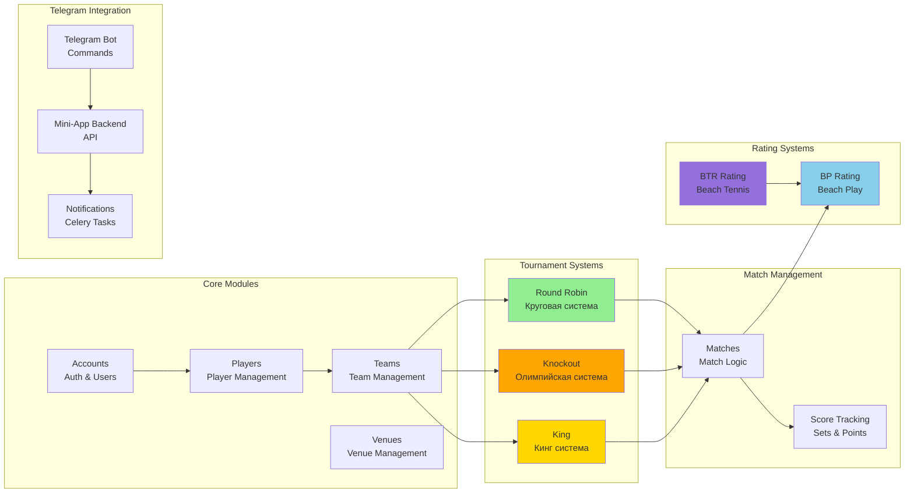
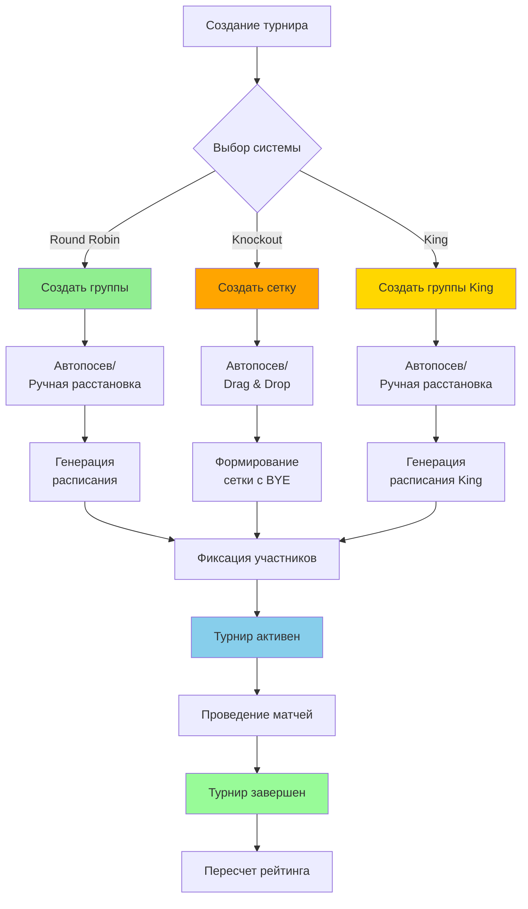
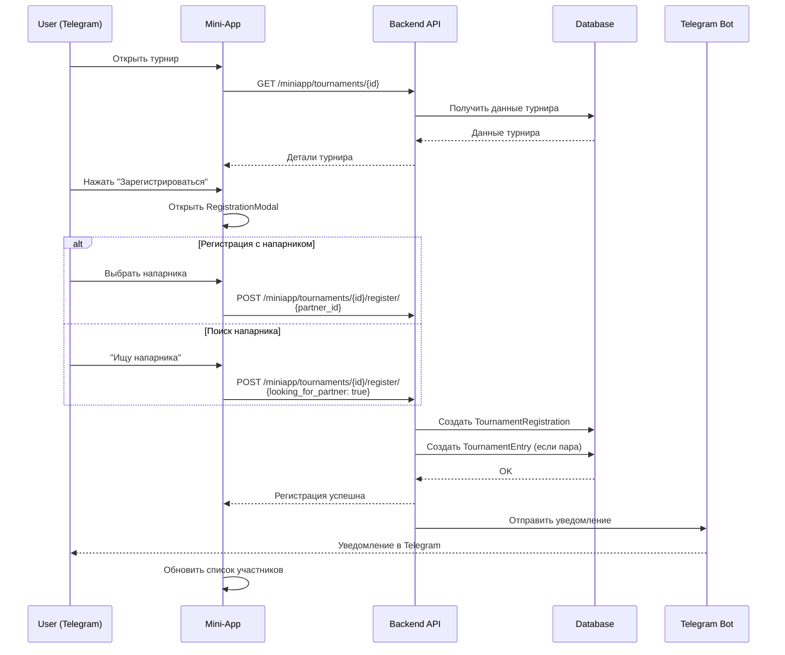
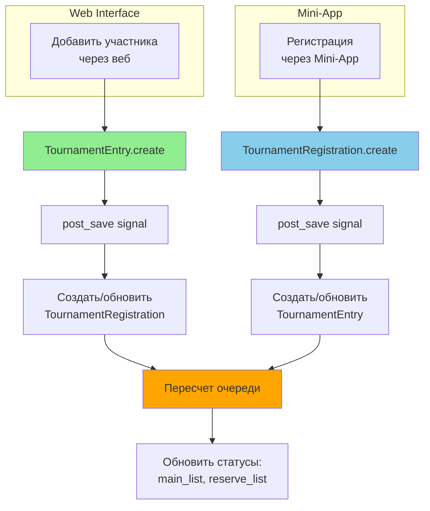
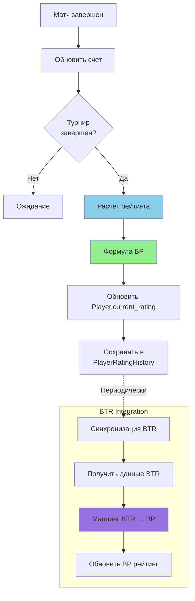
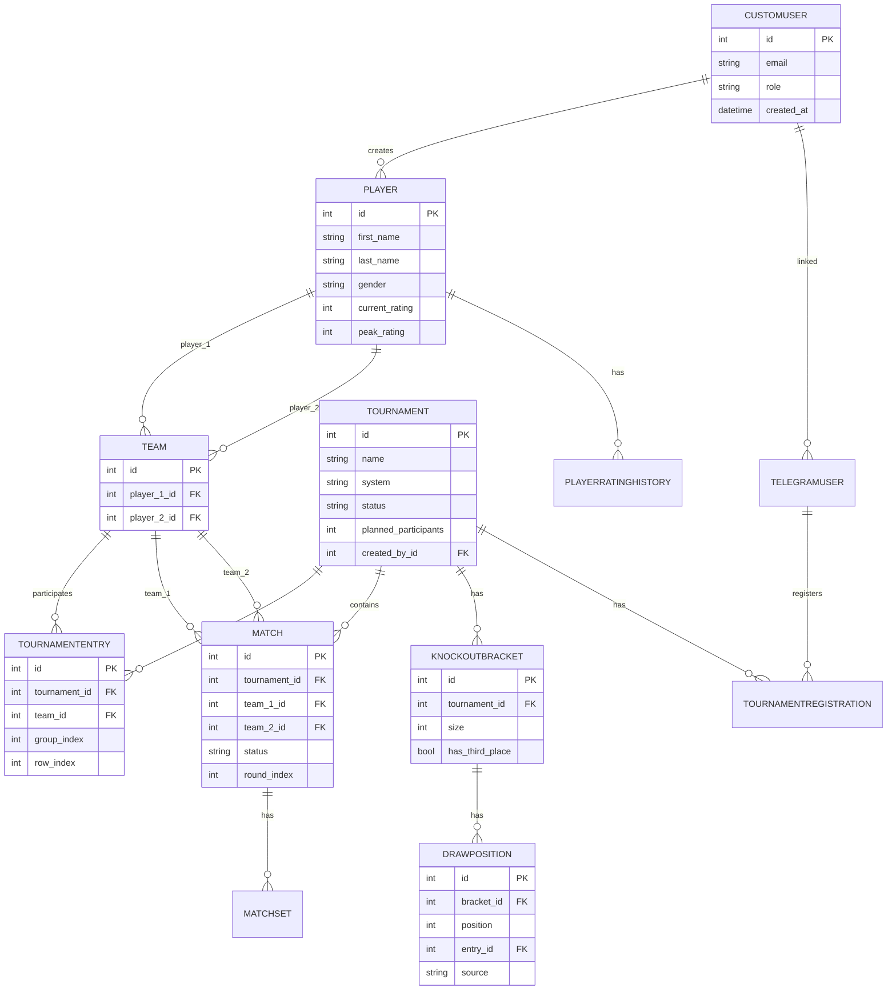

# Архитектура системы SandMatch

## Общая архитектура

```mermaid
graph TB
    subgraph "Frontend Layer"
        WEB[Web App<br/>React + TypeScript]
        MINIAPP[Mini-App<br/>Telegram WebApp]
    end
    
    subgraph "API Layer"
        API[Django REST API<br/>JWT Auth]
    end
    
    subgraph "Backend Services"
        DJANGO[Django<br/>Business Logic]
        CELERY[Celery<br/>Async Tasks]
        TGBOT[Telegram Bot<br/>python-telegram-bot]
    end
    
    subgraph "Data Layer"
        DB[(PostgreSQL<br/>Main Database)]
        REDIS[(Redis<br/>Cache + Queue)]
    end
    
    subgraph "External Services"
        TG[Telegram API]
        BTR[BTR Rating API]
    end
    
    WEB -->|REST API| API
    MINIAPP -->|REST API| API
    API --> DJANGO
    DJANGO --> DB
    DJANGO --> REDIS
    DJANGO --> CELERY
    CELERY --> REDIS
    CELERY --> DB
    TGBOT --> TG
    TGBOT --> DB
    DJANGO --> BTR
    CELERY --> TG
    
    style WEB fill:#61dafb
    style MINIAPP fill:#0088cc
    style API fill:#092e20
    style DJANGO fill:#092e20
    style DB fill:#336791
    style REDIS fill:#dc382d
```

---

## Модульная архитектура

---

## Турнирные системы - детальная схема

---

## Регистрация на турнир (Mini-App)

---

## Синхронизация TournamentEntry ↔ TournamentRegistration

---

## Рейтинговая система

---

## CI/CD Pipeline

```mermaid
graph LR
    PUSH[git push main] --> CI[GitHub Actions CI]
    
    CI --> BUILD_FE[Build Frontend<br/>npm run build]
    CI --> TEST_BE[Test Backend<br/>Django checks]
    
    BUILD_FE --> DOCKER[Build Docker Image]
    TEST_BE --> DOCKER
    
    DOCKER --> PUSH_IMG[Push to GHCR<br/>ghcr.io/ekimteam/sandmatch/web]
    
    PUSH_IMG --> CD[GitHub Actions CD]
    
    CD --> SSH[SSH to Production]
    SSH --> PULL[docker compose pull]
    PULL --> MIGRATE[Run Migrations]
    MIGRATE --> STATIC[collectstatic]
    STATIC --> RESTART[docker compose up -d]
    
    RESTART --> HEALTH[Health Checks]
    HEALTH --> SMOKE[Smoke Tests]
    SMOKE --> DONE[✅ Deployed]
    
    style CI fill:#2088ff
    style CD fill:#28a745
    style DONE fill:#90ee90
```

---

## Структура базы данных (основные таблицы)

---

**Дата создания**: 29 декабря 2024  
**Версия**: 1.0
